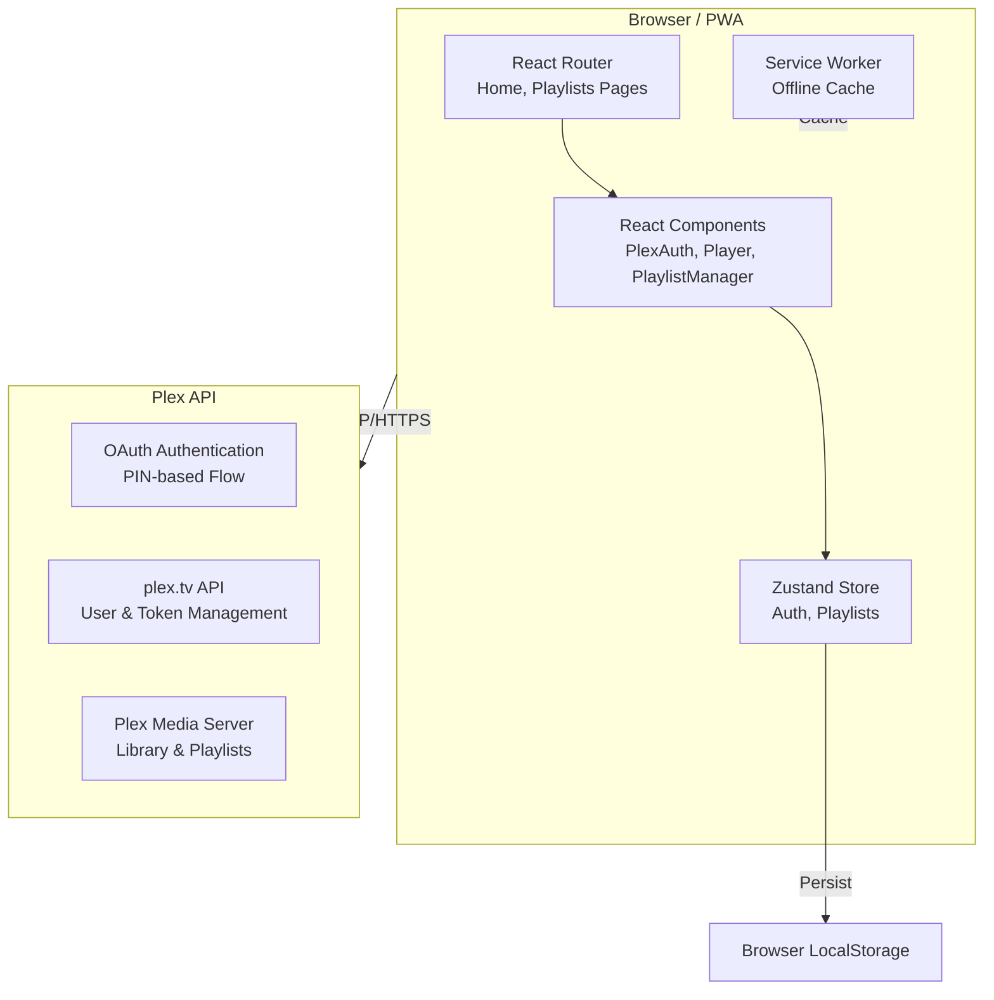

# PlexM8 Architecture

System design, component hierarchy, and state management patterns.

## System Overview



## Component Hierarchy

```
App
├── InstallPrompt (PWA)
├── PlexAuth (Authentication)
└── Router
    ├── Home
    │   ├── Player
    │   └── PlaylistManager
    └── Playlists
        └── PlaylistGrid
```

## State Management

### Zustand Stores

#### AuthStore
- **Purpose**: User authentication and identity
- **Persistence**: localStorage (`plexm8-auth`)
- **Fields**:
  - `token`: Plex API access token
  - `clientId`: Unique device identifier
  - `userId`: Plex user ID
  - `initialized`: Auth initialization flag

#### PlaylistStore
- **Purpose**: Playlist data and current selection
- **Persistence**: localStorage (`plexm8-playlists`)
- **Fields**:
  - `playlists[]`: Array of playlist metadata
  - `currentPlaylist`: Currently active playlist

## Data Flow

### Authentication Flow

```
1. User clicks "Sign in with Plex"
   ↓
2. App creates PIN via plex.tv API
   ↓
3. User authenticates in browser
   (Opens Plex auth app)
   ↓
4. App polls PIN status
   ↓
5. Token received and stored
   ↓
6. Auth complete → Navigate to Home
```

### Playlist Loading

```
1. App requests resources from Plex
   ↓
2. Receives list of available servers
   ↓
3. User selects server
   ↓
4. App fetches playlists from server
   ↓
5. Store caches playlist metadata
   ↓
6. Display in UI
```

## API Integration

### PlexApiClient

Core client for Plex API communication:

```typescript
class PlexApiClient {
  - createPin(): Generate auth PIN
  - checkPin(id): Check PIN status, get token
  - getCurrentUser(): Fetch user info
  - getResources(): List available servers
  - setToken(): Update auth token
}
```

### Custom Hooks

- `usePlexApi<T>()`: Generic API state management
- `useCurrentUser()`: Fetch user information
- `useResources()`: Fetch server list

## Service Worker Strategy

### Caching Strategy

```
Static Assets:
  Strategy: Cache First → Network Fallback
  Content: HTML, CSS, JS, icons
  
API Requests:
  Strategy: Network First → Cache Fallback
  Content: API responses (optional)
```

### Offline Support

- App shell cached for offline loading
- Playlists cached if previously loaded
- API calls fail gracefully
- User can browse cached playlists

## Security Architecture

### Token Management

```
User Login
  ↓
PIN-based OAuth
  ↓
Token from plex.tv
  ↓
Stored in localStorage (encrypted by browser)
  ↓
Sent in X-Plex-Token header
```

### Data Security

- ✅ HTTPS-only communication
- ✅ Tokens never sent to external servers
- ✅ No personal data stored locally
- ✅ Service Worker caches only static assets
- ✅ XSS protection via React escaping

## Performance Optimization

### Code Splitting

```typescript
// Vite builds chunks for:
- vendor (React, Zustand, Axios)
- main (application code)
- pages (lazy-loaded routes)
```

### Asset Optimization

- Service Worker precaches critical assets
- Images lazy-loaded with browser native support
- CSS included in main bundle (small size)
- JavaScript minified and mangled

### Caching Headers

Configured in GitHub Pages deployment:
- Static assets: `max-age=31536000` (1 year)
- HTML: `no-cache` (always fetch latest)
- Service Worker: `no-cache` (always fetch latest)

## Error Handling

### API Errors

```typescript
try {
  await apiCall()
} catch (error) {
  // User-friendly error message
  // Fallback to cached data if available
  // Retry logic with exponential backoff
}
```

### User Feedback

- Error banners with clear messages
- Loading states during async operations
- Toast notifications for important events
- Graceful degradation for missing features

## Development Patterns

### Component Structure

```typescript
export default function ComponentName() {
  // Hooks (state, effects)
  // Event handlers
  // Computed values
  // JSX
  return <div>...</div>
}
```

### Store Usage

```typescript
const { data, setData } = useStore()

// Update state
setData(newValue)

// Listen for changes (component re-renders)
```

### API Usage

```typescript
const { data, loading, error, call } = usePlexApi()

const handleFetch = async () => {
  await call(() => client.fetchData())
}
```

## Testing Considerations

### Manual Testing

- Authentication flow on actual Plex server
- Playlist operations across devices
- Offline functionality
- Service Worker cache behavior

### Browser Testing

- Chrome/Edge DevTools for debugging
- Lighthouse for PWA score
- Network throttling for offline simulation

## Future Enhancements

### Phase 2

- [ ] Playlist collaboration/sharing
- [ ] Advanced search and filtering
- [ ] Playback history and recommendations
- [ ] Batch operations on playlists

### Phase 3

- [ ] Offline playlist editing (sync on reconnect)
- [ ] Advanced playlist rules (auto-populate)
- [ ] Export/import playlists
- [ ] Multi-server support

## Related Documentation

- [API Integration](./api/plex-integration.md) - Plex API details
- [Deployment](./deployment.md) - Production setup
- [PWA Setup](./pwa-setup.md) - Installation guide
