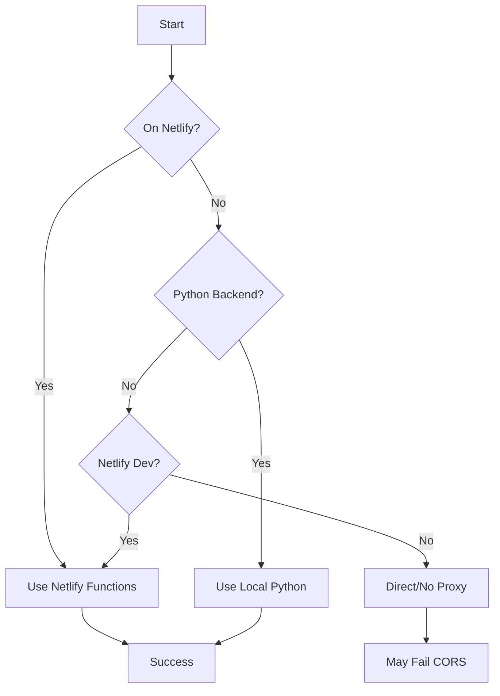

# Smart Connection Selection & Backend Detection

PlexM8 automatically selects the best connection method based on your environment.

## Connection Selection

### How It Works

The app intelligently chooses between local and public Plex server connections:

**Local Development** (`localhost:5173`)
- Prefers local/private IP addresses (192.168.x.x)
- Direct LAN connection for fastest access
- Example: `https://192-168-1-85.bef979c7a34a40db84dd22dc93bac606.plex.direct:32400`

**Production** (`plexm8.netlify.app`)
- Prefers public IP addresses
- Remote access from anywhere
- Example: `https://75-157-226-84.bef979c7a34a40db84dd22dc93bac606.plex.direct:21777`

### Connection Scoring

Each available connection is scored based on:
1. **Local vs Public** (100 points) - Based on environment
2. **Private IP Detection** (50 points) - 192.168.x.x, 10.x.x.x, etc.
3. **HTTPS Protocol** (20 points) - Prefer encrypted connections
4. **Direct Connection** (30 points) - Avoid slower relay connections
5. **IPv4** (10 points) - Better compatibility than IPv6

The highest-scoring connection is automatically selected.

## Backend Detection

### Available Backends

PlexM8 supports three backend modes:

#### 1. Netlify Functions (Production)
- **When**: Deployed to Netlify (`*.netlify.app`)
- **Endpoints**: `/.netlify/functions/plex-proxy`
- **Purpose**: CORS proxy for Plex API calls
- **Status**: Always available in production

#### 2. Local Python Backend (Development)
- **When**: Running Flask server at `http://localhost:5000`
- **Endpoints**: `http://localhost:5000/api/*`
- **Purpose**: Development testing, additional features
- **Setup**: See [Local Backend Setup](./setup/local-backend-setup.md)

#### 3. Direct Connection (Fallback)
- **When**: No proxy available
- **Warning**: May fail due to CORS restrictions
- **Use Case**: Testing, debugging

### Detection Process



### Implementation

**Automatic in Code:**
```typescript
import { getPlaylistsProxyUrl } from '@/utils/backendDetector';

// Automatically detects and routes to best backend
const url = await getPlaylistsProxyUrl(serverUrl, token, clientId);
const response = await axios.get(url);
```

**Manual Check:**
```typescript
import { detectBackend } from '@/utils/backendDetector';

const backend = await detectBackend();
console.log(backend);
// {
//   type: 'netlify' | 'local-python' | 'direct',
//   baseUrl: '/.netlify/functions',
//   available: true
// }
```

## Benefits

### For Users
- ✅ Seamless experience across environments
- ✅ Automatic fallback if primary backend unavailable
- ✅ Optimal performance (local vs remote)
- ✅ Works without configuration

### For Developers
- ✅ Test with real Plex server in local dev
- ✅ No need for Netlify CLI (`netlify dev`)
- ✅ Optional Python backend for advanced features
- ✅ Clear console logging for debugging

## Troubleshooting

### "No valid connection found"
**Cause**: Plex server has no accessible connections
**Solution**: 
1. Check server is online in Plex Web
2. Verify port forwarding if remote
3. Check firewall settings

### "Failed to fetch playlists: ETIMEDOUT"
**Cause**: Selected connection is unreachable
**Solution**:
1. Increase timeout in Settings (⚙️ → API → Request Timeout)
2. Check network connectivity
3. Try different Plex server if multiple available

### "404 Not Found" on `/.netlify/functions/*`
**Cause**: Netlify Functions only work on Netlify platform
**Solution**:
- **For testing**: Deploy to Netlify or use Python backend
- **For development**: Connection selector will use direct mode

### Backend Detection Not Working
**Force Re-Detection:**
```typescript
import { resetBackendCache } from '@/utils/backendDetector';
resetBackendCache();
```

## Related Files

| File | Purpose |
|------|---------|
| `src/utils/connectionSelector.ts` | Smart connection selection logic |
| `src/utils/backendDetector.ts` | Backend availability detection |
| `src/hooks/usePlaylists.ts` | Implementation example |
| `netlify/functions/plex-proxy.ts` | Netlify Functions proxy |
| `tools/python/server.py` | Local Python backend (optional) |

## Configuration

### Adjust Connection Preferences

Edit Settings (⚙️ icon):
- **API Timeout**: Increase for high-latency connections
- **Debug Mode**: Enable to see connection selection logs

### Override Automatic Selection

Currently not exposed in UI. To force specific connection:

```typescript
// In src/hooks/usePlaylists.ts
const serverUrl = selectedServer.connections.find(c => 
  c.address === '75.157.226.84' // Force public IP
)?.uri;
```

## Future Enhancements

- [ ] Manual connection preference in Settings
- [ ] Connection speed testing
- [ ] Automatic failover on timeout
- [ ] Connection health monitoring
- [ ] User-defined connection priority
