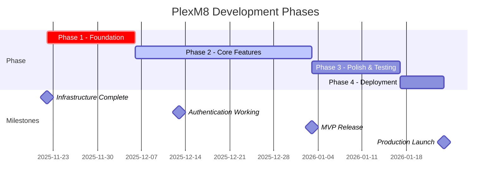

# Project Progress

Status tracking, roadmap, and development timeline for PlexM8.

## Current Status: Initial Setup Complete ✅

**Phase**: Foundation & Infrastructure
**Started**: November 2025
**Current Version**: 0.1.0 (Pre-alpha)

## Project Timeline



## Phase 1: Foundation & Infrastructure ✅ COMPLETE

### Completed Tasks

- ✅ Project setup with React + TypeScript + Vite
- ✅ ESLint and TypeScript configuration
- ✅ Package.json with all dependencies
- ✅ Zustand store setup for state management
- ✅ GitHub Actions workflow for CI/CD
- ✅ PWA configuration (manifest, service worker)
- ✅ Complete documentation structure
- ✅ GitHub Pages deployment pipeline

### Deliverables

```
✅ Workspace structure created
✅ Build system configured
✅ Development environment ready
✅ GitHub Pages deployment ready
✅ PWA support configured
✅ Documentation templates ready
```

### Technical Stack Chosen

| Component | Technology | Rationale |
|-----------|-----------|-----------|
| Framework | React 18 | Modern, component-based, large ecosystem |
| Language | TypeScript | Type safety, better IDE support |
| Build | Vite | Fast builds, optimized for SPAs |
| State | Zustand | Lightweight, persistent storage |
| Routing | React Router v6 | Standard SPA routing |
| HTTP Client | Axios | Promise-based, interceptor support |
| Styling | CSS + CSS Variables | No build overhead, small bundle |
| Deployment | GitHub Pages | Free, integrated with git workflow |
| PWA | Service Worker + Manifest | Native support, offline functionality |

### Key Files Created

```
✅ package.json - Dependencies and scripts
✅ tsconfig.json - TypeScript configuration
✅ vite.config.ts - Build configuration
✅ public/manifest.json - PWA manifest
✅ public/service-worker.js - Offline support
✅ src/App.tsx - Root component
✅ src/main.tsx - Entry point
✅ src/api/plex.ts - Plex API client
✅ src/utils/storage.ts - State management
✅ All component skeletons
✅ CSS styling system
✅ .github/workflows/deploy-gh-pages.yml - CI/CD
✅ Complete documentation (6 guides)
```

## Phase 2: Core Features (IN PROGRESS)

### Tasks

- [ ] **Authentication Flow** (WIP)
  - [ ] PIN creation endpoint integration
  - [ ] User authentication polling
  - [ ] Token storage and validation
  - [ ] Logout functionality
  - [ ] Error handling and edge cases
  
- [ ] **Plex Server Integration**
  - [ ] Get available servers endpoint
  - [ ] Connection URL selection (local/remote)
  - [ ] Music library detection
  - [ ] Error handling for offline servers

- [ ] **Playlist Management**
  - [ ] Fetch playlists from server
  - [ ] Display playlist grid
  - [ ] Create new playlist
  - [ ] Edit playlist details
  - [ ] Delete playlist
  - [ ] Sort and filter playlists

- [ ] **Music Player**
  - [ ] Basic playback controls
  - [ ] Track information display
  - [ ] Duration and progress tracking
  - [ ] Next/previous track navigation
  - [ ] Volume control

- [ ] **Testing**
  - [ ] Manual testing on Chrome
  - [ ] Manual testing on Android
  - [ ] Authentication flow testing
  - [ ] Playlist operations testing

### Estimated Timeline

- Authentication: 1 week
- Server integration: 1 week
- Playlist management: 1.5 weeks
- Music player: 0.5 weeks

## Phase 3: Polish & Testing

### Tasks

- [ ] **UI/UX Refinement**
  - [ ] Design review
  - [ ] Mobile responsiveness fixes
  - [ ] Animation polish
  - [ ] Accessibility improvements
  - [ ] Dark mode optimization

- [ ] **Performance Optimization**
  - [ ] Bundle size analysis
  - [ ] Code splitting optimization
  - [ ] Image optimization
  - [ ] Cache strategy refinement
  - [ ] Lighthouse score 90+

- [ ] **Comprehensive Testing**
  - [ ] Desktop browser testing (Chrome, Edge, Firefox, Safari)
  - [ ] Mobile browser testing (Android Chrome, Edge)
  - [ ] iOS Safari testing
  - [ ] Offline functionality testing
  - [ ] Authentication flow edge cases
  - [ ] Error scenarios

- [ ] **Documentation Completion**
  - [ ] User guide
  - [ ] Troubleshooting guide
  - [ ] API changes documentation
  - [ ] Contributing guidelines

## Phase 4: Deployment & Launch

### Tasks

- [ ] **Production Hardening**
  - [ ] Security audit
  - [ ] HTTPS verification
  - [ ] CORS configuration
  - [ ] Error monitoring setup

- [ ] **Launch Preparation**
  - [ ] Final testing pass
  - [ ] Documentation review
  - [ ] Release notes preparation
  - [ ] Feature freeze

- [ ] **Deployment**
  - [ ] Push to main branch
  - [ ] Verify GitHub Pages deployment
  - [ ] Test all features in production
  - [ ] Monitor for issues

## Future Enhancements (Phase 5+)

### Short Term (1-2 months)

- [ ] Playlist collaboration/sharing
- [ ] Advanced search and filtering
- [ ] Playback history
- [ ] Recommendations engine
- [ ] Batch operations on playlists
- [ ] Playlist export/import

### Medium Term (2-4 months)

- [ ] Background sync for offline edits
- [ ] Advanced playlist rules
- [ ] Multi-server support
- [ ] Push notifications
- [ ] Web push for updates
- [ ] Analytics dashboard

### Long Term (4+ months)

- [ ] Mobile app versions (React Native)
- [ ] Desktop app (Electron)
- [ ] AI-powered playlist suggestions
- [ ] Community playlists
- [ ] Playlist marketplace
- [ ] Backend API for advanced features

## Metrics & Goals

### Quality Targets

```
Code Coverage: 80%+
TypeScript Coverage: 100%
Bundle Size: < 500KB (gzipped)
Lighthouse Score: 90+
Page Load: < 2s
First Paint: < 1s
```

### Performance Targets

```
TTFB (Time to First Byte): < 200ms
FCP (First Contentful Paint): < 1s
LCP (Largest Contentful Paint): < 2.5s
CLS (Cumulative Layout Shift): < 0.1
```

### User Adoption Targets

```
Phase 1 (MVP): Alpha testers
Phase 2: Beta users (50-100)
Phase 3: General availability
Phase 4: 1000+ active users
```

## Known Issues & Limitations

### Current Limitations

1. **Authentication**
   - PIN-based flow requires user interaction
   - Token refresh not automated (7-day limit)
   - No remember-me functionality yet

2. **Offline Mode**
   - Only previously-loaded data available
   - Cannot edit playlists offline
   - Cannot authenticate offline

3. **Playback**
   - No direct streaming (future phase)
   - No transcoding options
   - No quality settings

4. **Compatibility**
   - iOS PWA limited to Safari browser
   - No native app yet
   - Old browser support limited

### Planned Fixes

- [ ] Implement JWT token refresh flow
- [ ] Add offline edit sync capability
- [ ] Implement direct streaming
- [ ] Add quality/bitrate selection
- [ ] iOS native app
- [ ] Android native app

## Dependencies & Tools

### Development

- Node.js 18+
- npm or yarn
- Git
- GitHub account

### Runtime

- Modern browser (Chrome 90+, Edge 90+, Firefox 88+, Safari 14+)
- Plex Media Server (1.25+)
- Internet connection (for authentication and streaming)

### Infrastructure

- GitHub (version control, CI/CD)
- GitHub Pages (hosting)
- GitHub Actions (automation)

## Success Criteria

### Phase 1 ✅

- [x] Project structure complete
- [x] Build system working
- [x] Documentation framework ready
- [x] GitHub Pages deployment ready
- [x] PWA foundation established

### Phase 2

- [ ] Users can authenticate with Plex
- [ ] Playlists display correctly
- [ ] Basic playlist operations work
- [ ] Music player functional
- [ ] No critical bugs

### Phase 3

- [ ] All browsers tested and working
- [ ] Performance meets targets
- [ ] UI polished and responsive
- [ ] Documentation complete
- [ ] User guide available

### Phase 4

- [ ] Application deployed to production
- [ ] Accessible via GitHub Pages
- [ ] Installable as PWA
- [ ] Offline functionality working
- [ ] Monitoring in place

## Communication & Updates

### Progress Updates

- Weekly status updates in project discussions
- Bi-weekly team sync meetings
- Monthly feature releases

### Issue Tracking

- GitHub Issues for bugs and features
- GitHub Discussions for features/ideas
- GitHub Projects for sprint planning

## Resources

### Documentation

- [Plex API Documentation](https://developer.plex.tv/pms/)
- [React Documentation](https://react.dev)
- [TypeScript Handbook](https://www.typescriptlang.org/docs/)
- [Vite Documentation](https://vitejs.dev)

### Tools

- [GitHub Actions Docs](https://docs.github.com/en/actions)
- [GitHub Pages Docs](https://docs.github.com/en/pages)
- [Lighthouse](https://developers.google.com/web/tools/lighthouse)
- [WebAIM](https://webaim.org/)

## Contact & Questions

For questions about the project:
1. Check documentation
2. Search existing issues
3. Open a discussion on GitHub
4. Create an issue with details

---

**Last Updated**: November 22, 2025
**Next Review**: When Phase 2 reaches 50% completion
